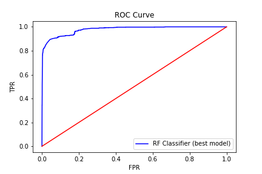

# case-study-fraud-detection

### Authors: Karey, Megano, Nick, Aymeric


## EXAMPLE USAGE

### From bash:

```bash
$ python predict.py example.json
```

This will give you a prediction of a json object respecting the following schema:
['fraud', 'eur', 'gbp', 'ach', 'check', 'missing_payment', 'dict_elements', 'gts',
'has_logo', 'user_type', 'delivery_method', 'org_facebook', 'org_twitter', 'has_analytics']

## The problem
We are interested in building a model to predict whether or not an event is fraudulent or not.

The data is 14,337 events from 2007-2013, of which 1,239 are fraudulent.  (We define events as fraudulent if the account type is labeled as fraudster, fraudulent_event, or fraudster_att.  We don’t classify spamming events as fraudulent.)

## Overall model scores:
F1 score: 0.87, Precision: 0.96, Recall: 0.79, Accuracy: 0.98
(0.86963906581740968,
 0.96421845574387943,
 0.79195668986852286,
 0.97858687312547954)

## ROC curve

